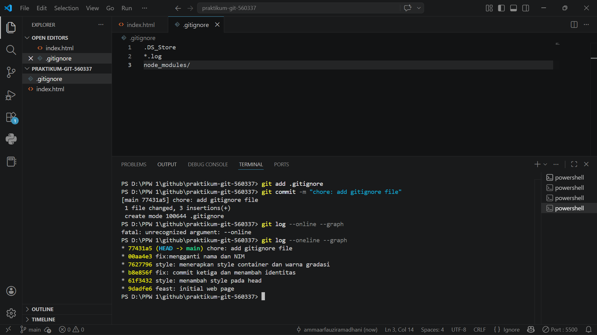
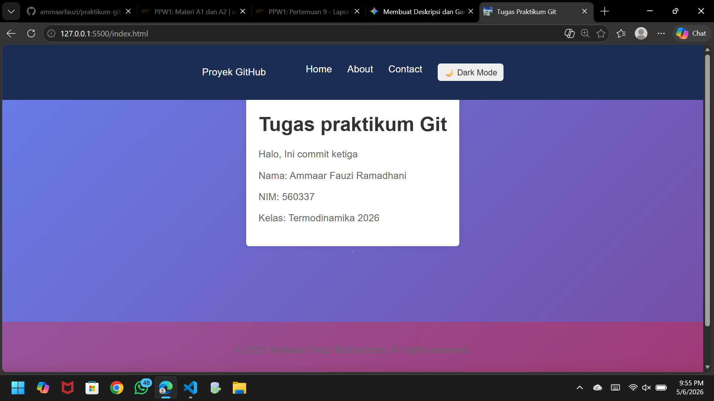
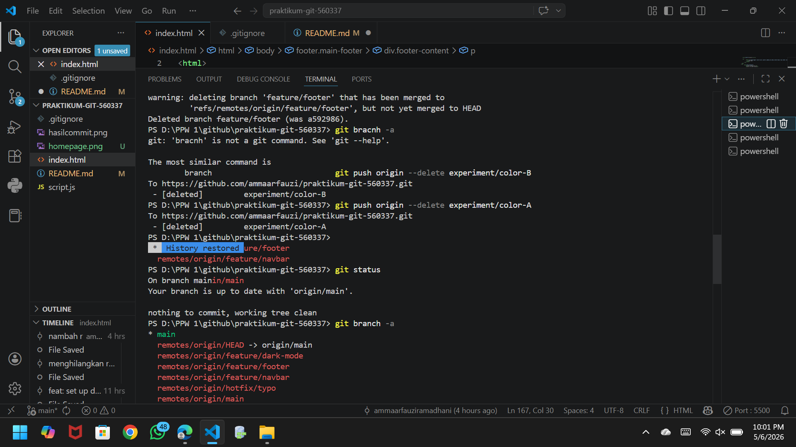
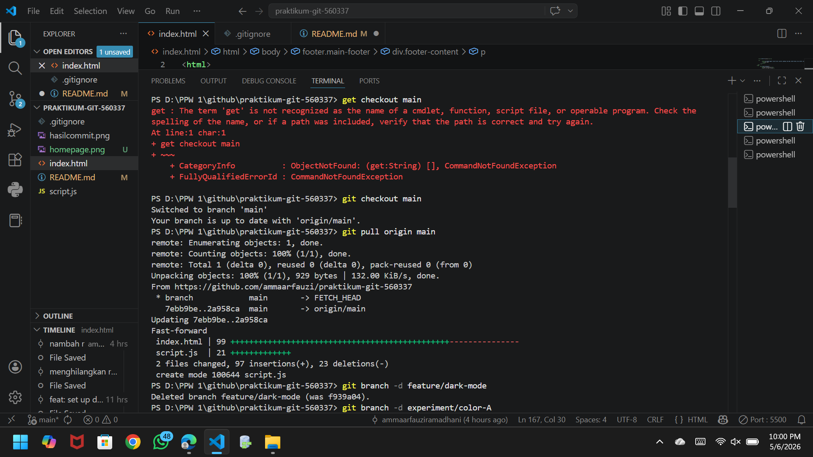
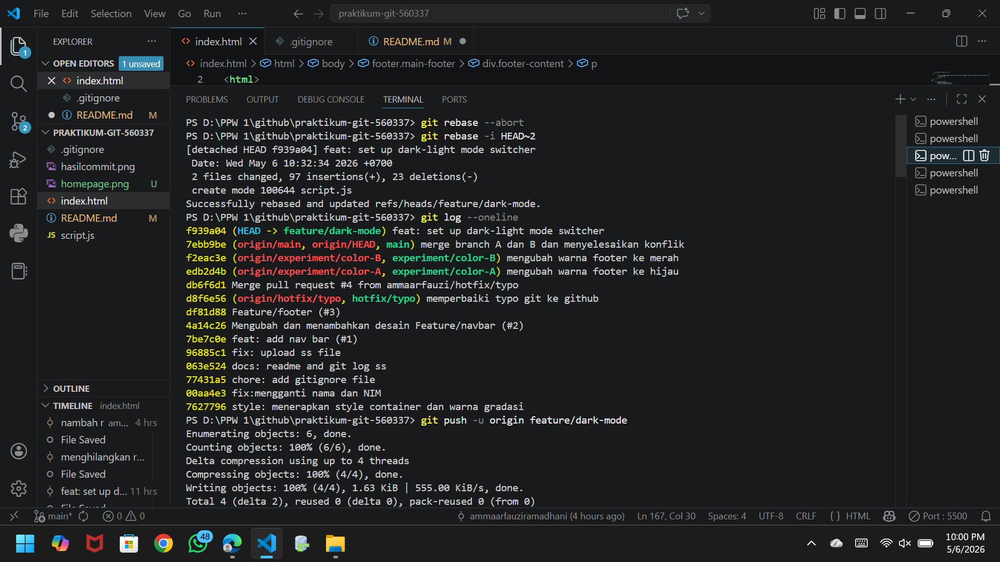
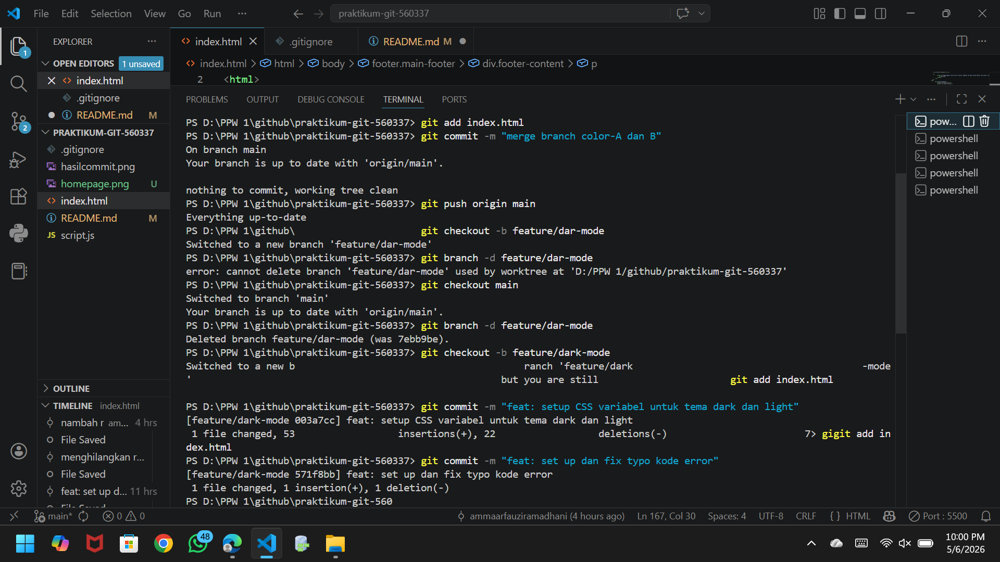
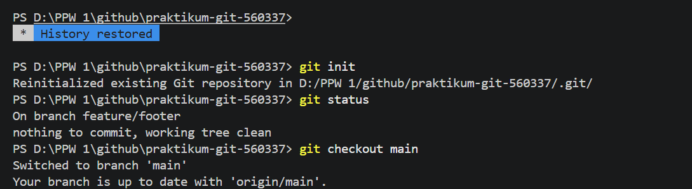

# Tugas Praktikum Git - Website Profil Sederhana
proyek ini adalah sebuah halaman web profil statis yang dikembangkan sebagai bagian dari tugas praktikum Git. Website ini menampilkan informasi dasar mahasiswa dan merupakan implementasi awl dari penggunaan kontrol versi git. 
## Fitur Utama
* Navigasi Bar: Menu sederhana yang mencakup Home, About, dan Contact
* Dark Mode Toggle: Fitur untuk mengubah tema tampilan menjadi mode gelap
* Desain responsif: Layout yang bersih dengan kartu informasi di bagian tengah menggunakan skema warna gradasi.
## Informasi Mahasiswa
* Nama: Ammaar Fauzi Ramadhani
* NIM: 560337
* Mata Kuliah: Termodinamika 2026

* git branch -a: menampilkan branch yang aktif di lokal dan remote
* git push origin --delete (nama branch): menghapus branch di github
* git status: mengecek berada di branch mana saat ini

* git checkout -b (nama cabang): membuat cabang baru
* git checkout (nama cabang): berpindah ke cabang lain
* git pull origin (nama cabang): mengambil updat terbaru dari github

* git rebase -i HEAD~(angka): meleburkan beberapa commit terakhir menjadi 1 commit
* git rebase --abort: membatalkan rebase
* git log --oneline: menampilkan beberapa commit terakhir yang telah dilakukan
* git push -u origin (nama cabang) : mengupload cabang ke github pertama kali
* git push origin (nama cabang): mengupdate pembaruan cabang

* git add (nama file): berfungsi untuk memindahkan perubahan file dari direktori kerja (Working Directory) ke area persiapan yang disebut Staging Area.
* git commit -m "pesan": untuk menyimpan secara permanen perubahan yang sebelumnya sudah kamu masukkan ke Staging Area (melalui git add) ke dalam basis data Git (Repository).

* git init: membuat repositori Git baru dalam sebuah proyek.